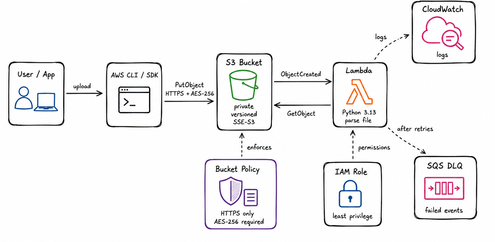

# AWS S3 File Processor

This project is a small S3 file ingestion pipeline built with AWS CDK and
Python. When a file is uploaded to the input bucket, S3 triggers a Lambda
function. The function reads the first non-empty line, parses it, and writes the
result to CloudWatch Logs so it is easy to verify during testing. In a real
workflow, that destination could be changed to SQS, EventBridge, DynamoDB, or
another S3 bucket depending on how the parsed data needs to be used.

I structured the infrastructure as a reusable S3-to-Lambda pattern instead of
putting everything directly in the stack. The stack stays small, and the bucket,
bucket policy, Lambda, IAM permissions, log group, and DLQ live together in
`cdk_patterns/s3_file_processor.py`. That makes it easier to reuse the same
setup later with different names, Lambda code, or object filters.

## Architecture



Flow:

1. A user or system uploads a file to S3.
2. The bucket policy only allows secure uploads: HTTPS is required, and each
   upload must use SSE-S3 encryption with AES-256.
3. S3 sends an `ObjectCreated` event to Lambda.
4. Lambda reads the object from S3 and parses the first line.
5. Parsed output is logged to CloudWatch for review.
6. Unhandled async Lambda failures retry and then go to the SQS DLQ.

Main resources:

| Resource | Default name | Notes |
|---|---|---|
| S3 bucket | `file-processor-input-{account-id}` | Versioned, private, SSE-S3 |
| Lambda | `file-processor` | Python 3.13 parser |
| Log group | `/app/file-processor` | Parsing output and errors |
| SQS DLQ | `file-processor-dlq` | Failed async invocations |

## Reusable Components And Default Configuration

The core S3-to-Lambda setup is in a CDK construct instead of being written
directly in the stack. That keeps the stack simple and makes it easier to reuse
the same pattern with different names, Lambda code, or S3 event filters.

The construct includes a few defaults that should be consistent across deployments:

- S3 public access is blocked
- uploads must use HTTPS
- uploads must use SSE-S3 encryption with AES-256
- the Lambda role is scoped to this bucket
- CloudWatch logging and a DLQ are included
- the input bucket is retained on destroy to avoid deleting files by accident

## Parser Behavior

The Lambda only looks at the first non-empty line in the file. It currently
handles:

- JSON, for example `{"ticker":"AAPL","price":"189.42"}`
- comma-separated `key=value` pairs, for example `name=Anirudh,role=engineer`
- CSV-style values, for example `AAPL,189.42,2026-05-31`
- plain text

## Project Layout

```text
.
├── app.py                         # CDK app entry point
├── cdk_patterns/
│   └── s3_file_processor.py       # Reusable S3-to-Lambda construct
├── stacks/
│   └── file_processor_stack.py    # Thin stack using the construct
├── lambda/
│   ├── handler.py                 # Lambda parser
│   └── tests/
│       └── test_handler.py
├── scripts/
│   └── deploy.py                  # Helper for synth/deploy with custom names
├── docs/
│   └── architecture.png
├── requirements/
│   ├── requirements.txt
│   └── requirements-dev.txt
└── .github/workflows/ci.yml
```

## Running It

This was tested with Python 3.13, Node.js 24, AWS CLI v2, and the AWS CDK CLI.
After cloning the repo, create a virtual environment and install the Python
dependencies:

```bash
python3.13 -m venv .venv
source .venv/bin/activate
pip install -r requirements/requirements.txt
pip install -r requirements/requirements-dev.txt
```

Run the unit tests before deploying:

```bash
python -m pytest lambda/tests/ -v
```

If the AWS account has not been bootstrapped for CDK yet, run:

```bash
cdk bootstrap
```

I included `scripts/deploy.py` as a small wrapper around CDK context values. It
keeps the deploy command readable when names or S3 filters need to change.

Preview the CloudFormation template:

```bash
python scripts/deploy.py --synth \
  --app-name file-processor \
  --stack-name FileProcessorStack \
  --bucket-name-prefix file-processor \
  --region us-east-1
```

Deploy the stack:

```bash
python scripts/deploy.py \
  --app-name file-processor \
  --stack-name FileProcessorStack \
  --bucket-name-prefix file-processor \
  --region us-east-1
```

The same construct can be reused with different names or filters. For example,
this deploys a CSV-only processor:

```bash
python scripts/deploy.py \
  --app-name trade-file-processor \
  --stack-name TradeFileProcessorStack \
  --bucket-name-prefix trade-files \
  --object-suffix .csv \
  --region us-east-1
```

The most useful deploy options are `--app-name`, `--stack-name`,
`--bucket-name-prefix`, `--lambda-code-path`, `--object-prefix`,
`--object-suffix`, and `--region`.

## Quick Validation

After deployment, get the bucket name from the stack output:

```bash
BUCKET=$(aws cloudformation describe-stacks \
  --stack-name FileProcessorStack \
  --query "Stacks[0].Outputs[?OutputKey=='BucketName'].OutputValue" \
  --output text)
```

Upload a file with the required encryption flag:

```bash
echo "name=Anirudh,role=engineer,env=test" | \
  aws s3 cp - s3://$BUCKET/test-key-value.txt --sse AES256
```

Then check the Lambda logs:

```bash
aws logs tail /app/file-processor --since 5m
```

You should see the S3 event, the object key, and the parsed result.

To check the bucket policy, try the same upload without `--sse AES256`. It
should fail with `AccessDenied`.

```bash
echo "should fail" | aws s3 cp - s3://$BUCKET/should-fail.txt
```

The DLQ can be tested by invoking the Lambda asynchronously with a malformed
event. After the retries are exhausted, the failed event should show up in SQS.

```bash
aws lambda invoke \
  --function-name file-processor \
  --invocation-type Event \
  --cli-binary-format raw-in-base64-out \
  --payload '{"Records":[{"bad":"event"}]}' \
  /tmp/lambda-dlq-test-response.json

DLQ_URL=$(aws cloudformation describe-stacks \
  --stack-name FileProcessorStack \
  --query "Stacks[0].Outputs[?OutputKey=='DLQUrl'].OutputValue" \
  --output text)

aws sqs receive-message \
  --queue-url $DLQ_URL \
  --wait-time-seconds 20 \
  --attribute-names All \
  --message-attribute-names All
```

## Cleanup

```bash
cdk destroy FileProcessorStack --app ".venv/bin/python app.py"
```

The input bucket is retained by design. For a full cleanup, delete all object
versions from the bucket and then delete the bucket.

## CI

`.github/workflows/ci.yml` runs tests, linting, and `cdk synth` on pushes to
`main`.

## Future Improvements

If I were turning this into a production internal pattern, I would add:

- KMS key support for teams that need customer-managed encryption
- CloudWatch alarms for Lambda errors and DLQ depth
- Support for using an existing bucket
- A GitHub Actions based deployment workflow
